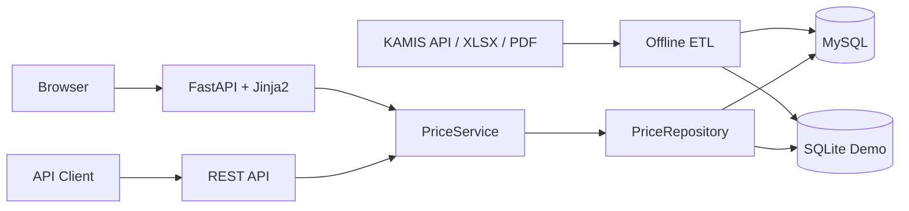

# SmartShopping Price Web Service

KAMIS 공공 농산물 가격을 수집·정제·저장하고, 사용자가 웹에서 품목별 도매·소매 가격과 데이터 신선도를 검색할 수 있는 Python 웹서비스입니다.

외부 API 연동부터 ETL, 관계형 데이터 모델링, REST API, 반응형 웹 화면까지 하나의 서비스로 연결했습니다. 평가자는 KAMIS 인증키나 MySQL 없이 SQLite 데모 모드로 바로 실행할 수 있습니다.

## Quick Start

```bash
python -m venv .venv
source .venv/bin/activate
python -m pip install -r requirements.txt
python tools/seed_demo_db.py
uvicorn web.app:app --reload
```

Windows PowerShell에서는 가상환경 활성화 명령만 다음과 같이 바꿉니다.

```powershell
.\.venv\Scripts\Activate.ps1
```

- 웹 화면: <http://127.0.0.1:8000>
- Swagger API 문서: <http://127.0.0.1:8000/docs>
- 가격 조회 API: <http://127.0.0.1:8000/api/prices>

## Project Overview

- 목표: 반복적으로 유입되는 농산물 가격을 안정적으로 정제하고 웹과 API로 제공
- 정형 데이터 `CSV`, `XLSX`
- 비정형 데이터 `PDF`
- KAMIS 공공 API
- MySQL 운영 DB / SQLite 데모 DB
- FastAPI REST API
- Jinja2 반응형 웹 화면
- 분석용 CSV 마트
- Power BI 대시보드

## Key Features

- 스프레드시트와 PDF를 함께 수집하는 ETL 파이프라인
- KAMIS 최근일자 도·소매가격 API 선택적 수집
- KAMIS 품목·품종·등급·최근가격 스냅샷을 독립된 테이블로 정규화
- 품목명 부분 검색과 도매·소매 필터
- 페이지네이션을 지원하는 가격 조회 REST API
- 조사일 기준 `FRESH` / `CAUTION` / `STALE` 신선도 표시
- DB 장애 시 내부정보를 숨기는 API·웹 오류 처리
- 인증키 없이 실행 가능한 6건의 재현 가능한 SQLite 데모 데이터
- 주차별/월별 분석용 CSV 마트 생성
- SQL 기반 가격 비교 분석
- Power BI 기반 시각화 대시보드 구성

## Architecture



웹 요청 중에는 KAMIS를 호출하지 않습니다. ETL과 웹 조회를 분리해 외부 API 장애나 지연이 사용자 요청에 전파되지 않도록 했습니다. 웹 화면과 REST API는 같은 `PriceService`를 사용하므로 검색 규칙과 응답 데이터가 일관됩니다.

## Web API

품목명, 시장 구분, 페이지를 조합해 조회할 수 있습니다.

```http
GET /api/prices?q=배추&market_type=retail&page=1&page_size=20
```

```json
{
  "items": [
    {
      "item_name": "배추",
      "variety_name": "여름",
      "product_cls_name": "소매",
      "grade_name": "상품",
      "unit": "포기",
      "unit_size": "1",
      "price": 3450,
      "examined_date": "2026-08-21",
      "freshness_days": 2,
      "freshness_status": "FRESH",
      "freshness_label": "최신"
    }
  ],
  "page": 1,
  "page_size": 20,
  "total": 1,
  "total_pages": 1
}
```

`market_type`은 `retail` 또는 `wholesale`을 사용하며, 잘못된 필터와 페이지 값은 HTTP 422로 처리합니다. DB 조회 장애는 HTTP 503과 고정 오류 코드로 반환하고 연결 문자열이나 원본 예외를 노출하지 않습니다.

## Test

```bash
python -m unittest discover -s tests -v
```

저장소·서비스 테스트는 실제 인메모리 SQLite를 사용합니다. API와 웹 화면 테스트도 ASGI 요청 전체 경로를 실행하며 검색, 필터, 정렬, 페이지네이션, 신선도 경계, 빈 결과, 입력 오류, DB 장애를 검증합니다.

현재 테스트 스위트는 기존 ETL 회귀 테스트를 포함해 총 60개입니다.

## Data Model

기존 파일 ETL 테이블과 KAMIS API 테이블을 분리해 운영합니다.

- `Item`: 품목명, 단위
- `Week`: 시작일, 종료일, 주차, 연도, 월
- `MarketPrice`: 전통시장 가격, 대형마트 가격
- `WeeklyPrice`: 전주 가격, 현재 가격, 등락률
- `WeeklyReport`: 주간 요약, 주요 이슈, 제철 식재료
- `Category`: KAMIS 부류 코드와 이름
- `Product`: KAMIS 품목 코드와 이름
- `ProductVariant`: 품목별 품종 코드와 이름
- `Grade`: 등급 코드와 이름
- `RecentPriceSnapshot`: 조사일·도소매 구분·단위별 가격과 과거 비교가격
- `KAMISPriceAnalysis`: 품목 정보를 결합하고 조사일 신선도 상태를 계산하는 분석용 View

ERD 관점 관계는 아래와 같습니다.

- `Item` 1:N `MarketPrice`
- `Item` 1:N `WeeklyPrice`
- `Week` 1:N `MarketPrice`
- `Week` 1:N `WeeklyPrice`
- `Week` 1:1 `WeeklyReport`
- `Category` 1:N `Product`
- `Product` 1:N `ProductVariant`
- `ProductVariant` 1:N `RecentPriceSnapshot`
- `Grade` 1:N `RecentPriceSnapshot`

## KAMIS API

공공데이터포털의 [한국농수산식품유통공사 최근일자 도·소매가격정보 API](https://www.data.go.kr/data/15156063/openapi.do)를 사용합니다. API만 실행할 때는 `--api-only`를 권장합니다.

```bash
export KAMIS_SERVICE_KEY="공공데이터포털에서 발급받은 일반 인증키"
python main.py --api-only
```

PowerShell에서는 다음과 같이 실행합니다.

```powershell
$env:KAMIS_SERVICE_KEY="공공데이터포털에서 발급받은 일반 인증키"
.\.venv\Scripts\python.exe main.py --api-only
```

API 가격은 기존 주간 가격에 섞지 않고 `Category → Product → ProductVariant → RecentPriceSnapshot ← Grade` 구조로 저장합니다. CSV는 `data/processed/api_price/` 아래의 `category.csv`, `product.csv`, `product_variant.csv`, `grade.csv`, `recent_price_snapshot.csv`로 생성합니다. API의 페이지당 최대 건수인 1,000건씩 전체 페이지를 순회합니다.

`--api-only`는 기존 XLSX/PDF 산출물을 건드리지 않고 API만 처리합니다. 기존 파일 ETL과 API를 함께 실행하려면 `--include-api`를 사용합니다.

### 가격 신선도

`KAMISPriceAnalysis` View는 조사일과 조회 당일의 차이를 기준으로 가격 상태를 계산합니다.

- `FRESH` / 최신: 30일 이내
- `CAUTION` / 주의: 31일 초과 1년 이내
- `STALE` / 오래됨: 1년 초과

`is_analysis_ready = 1`을 적용하면 1년 이내 가격만 분석할 수 있습니다. 원본 행은 삭제하지 않으므로 기준을 바꾸거나 과거 자료를 별도로 분석할 수 있습니다.

```sql
SELECT category_name, item_name, variety_name, product_cls_name,
       examined_date, freshness_status, unit, unit_size, price
FROM KAMISPriceAnalysis
WHERE is_analysis_ready = 1
ORDER BY examined_date DESC, item_name;
```

인증키와 DB 비밀번호는 저장소에 커밋하지 않습니다. 필요한 환경변수 목록은 `.env.example`을 참고하세요.

## ETL Flow

파이프라인 엔트리포인트는 `main.py`입니다.

1. 원본 데이터 탐색
- `etl.extract`에서 스프레드시트와 PDF 리포트 수집

2. 데이터 유형 판별
- 파일명과 헤더를 기준으로 `weekly` / `market` 데이터셋 분기

3. 정제 및 표준화
- `etl.transform`에서 주간 가격, 시장 가격 정규화
- 중복 행 제거와 컬럼 표준화 수행

4. 주차 메타데이터 생성
- 파일명 또는 헤더 날짜 범위로 `start_date`, `end_date`, `week_no`, `year`, `month` 추론

5. CSV 마트 생성
- `weekly_price.csv`
- `market_price.csv`
- `item.csv`
- `week.csv`
- `weekly_report.csv`
- `price_analysis_mart.csv`

6. 스키마 생성 및 DB 적재
- `sql/schema.sql` 기준으로 MySQL 스키마 생성
- 적재 결과를 분석 및 Power BI에서 활용

## Project Structure

```text
SmartShopping-DataEngineering/
├─ data/
│  ├─ raw/
│  ├─ extracted/
│  └─ processed/
├─ database/
├─ docs/
├─ etl/
│  ├─ extract.py
│  ├─ load.py
│  ├─ pdf_prices.py
│  ├─ pipeline.py
│  ├─ report.py
│  └─ transform.py
├─ sql/
│  └─ schema.sql
├─ tests/
├─ web/
│  ├─ app.py
│  ├─ database.py
│  ├─ models.py
│  ├─ repository.py
│  ├─ schemas.py
│  ├─ service.py
│  ├─ static/
│  └─ templates/
├─ tools/
│  └─ seed_demo_db.py
├─ config.py
├─ db.py
├─ main.py
└─ requirements.txt
```

## Tech Stack

- Python
- FastAPI
- Pydantic
- Jinja2
- pandas
- pdfplumber
- SQLAlchemy
- PyMySQL
- MySQL
- SQLite
- Power BI

## SQL Analysis Examples

이 프로젝트에서는 아래와 같은 분석을 수행했습니다.

- 전통시장 평균 가격 vs 대형마트 평균 가격
- 주차별 평균 가격 추이
- 월별 평균 가격 추이
- 품목별 가격 차이 분석
- 전통시장이 더 저렴한 품목 분석
- 대형마트가 더 저렴한 품목 분석
- 품목별 최고가 / 최저가 비교

## Power BI Dashboard

Power BI 대시보드는 3페이지로 구성했습니다.

### 1. Overview

- 전통시장 평균 가격
- 대형마트 평균 가격
- 가격 차이
- 주차별 평균 가격 추이
- 월별 평균 가격 추이
- 품목별 가격 차이

### 2. Item Analysis

- 품목별 최고가 비교
- 품목별 최저가 비교
- 품목별 가격 차이
- 더 저렴한 시장 분포

### 3. Weekly Report

- 주차 선택
- 주간 요약
- 주요 이슈
- 제철 식재료

## Automation

웹 요청과 외부 데이터 수집을 분리했습니다. `main.py --api-only`가 KAMIS 데이터를 수집·적재하고 FastAPI는 적재된 스냅샷만 조회합니다. 운영 스케줄링과 클라우드 배포는 현재 범위에 포함하지 않았습니다.

## Problems Solved

프로젝트 진행 중 해결한 주요 문제는 아래와 같습니다.

- 스프레드시트 헤더/중복 행 정제 문제
- PDF 가격 표 파싱 문제
- 시장 가격 / 주간 가격 데이터 표준화 문제
- 주차 메타데이터 추론 문제
- MySQL 적재용 스키마 정합성 문제
- MySQL과 SQLite에서 공유할 수 있는 가격 조회 SQL 설계
- 웹 화면과 REST API의 검색 규칙 일원화
- 입력 오류, 빈 결과, DB 장애의 안전한 HTTP 처리
- 조사일 기준 데이터 신선도 경계값 검증

## Improvements

추가 개선 포인트는 아래와 같습니다.

- 자동화 배치 구현
- 실제 운영 환경 배포와 상태 확인 엔드포인트
- Power BI 리포트 배포 자동화
- 데이터 품질 검증 리포트 고도화

## Portfolio Summary

정형·비정형 농산물 가격과 KAMIS 공공 API를 수집·정제해 MySQL에 적재하고, 동일 데이터를 FastAPI REST API와 반응형 웹 화면으로 제공하는 end-to-end Python 웹 프로젝트입니다. SQLite 데모 모드, 계층화된 조회 구조, 자동 테스트를 통해 실행 가능성과 유지보수성을 함께 보여줍니다.
